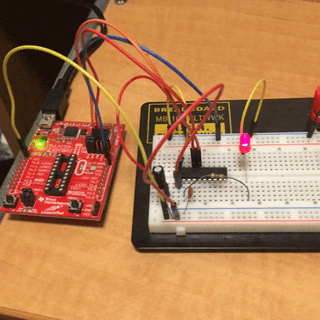

## Mitchell Hay

# Off-Board Blink
Unlike the other four MSP430 boards, the G2553 is able to be removed from the experimental board and used on a breadboard. The program to be run in this part of the lab is the same as the first part with the simple blink, only this time it would be done off the development board. An image of the breadboard setup is shown below. Proper values for resistors, bypass capacitors, and bulk capacitors need to be selected before running this program. These values are discussed more in depth later. 

# Devices
* MSP430F5529
* MSP430FR2311
* MSP430FR5994
* MSP430FR6989
* MSP430G2553

# Getting Started
## Dependencies
Each device requires no outside dependencies. Everything needed to run the program is included in the folder. Each folder is labeled with the device it is meant for.
## Setup
Each of the device projects in this part of the lab can be imported into Code Composer Studio and run from there. To import it, open CCS and select File -> Import -> Code Composer Studio -> CCS Project and select the desired directory.
## Breadboard
There are five pins on the G2553 chip that need to be connected:
* Voltage
* Ground
* LED Pin
* Test
* Reset
The breakout board can still be used to power the G2553 chip, so all pins on the board should be connected to the corresponding pins on the chip.

# Functionality
## Usage
There is nothing that needs to be done by the user once the program is loaded onto the device. There will be an LED blinking at a constant rate. Nothing can be done to change this rate, although that idea is covered in a different lab. 

# Known Errors
Be sure to connect the reset pin of the G2553 chip properly, or else there will be no output. If the breakout board is not being used, then the reset pin can be connected to a resistor in series with Vcc.

# Tasks
* [x] Review circuit design knowledge
* [x] Choose appropriate values for circuit elements
* [] Implement an offboard UART connection
